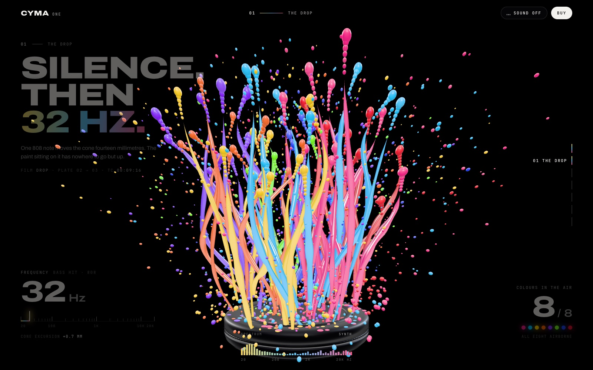
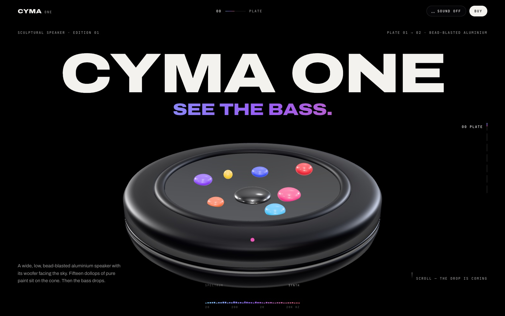
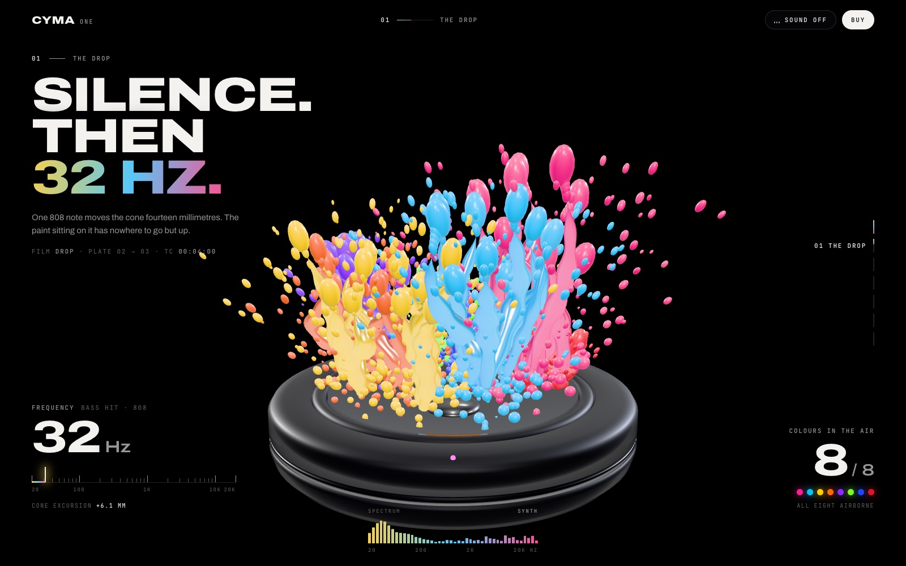
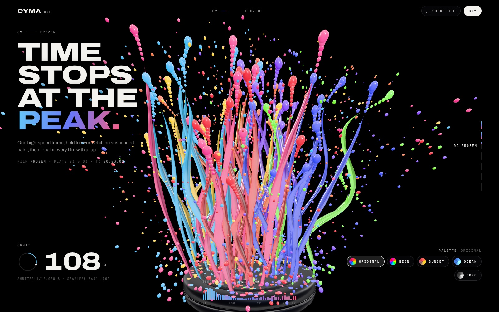
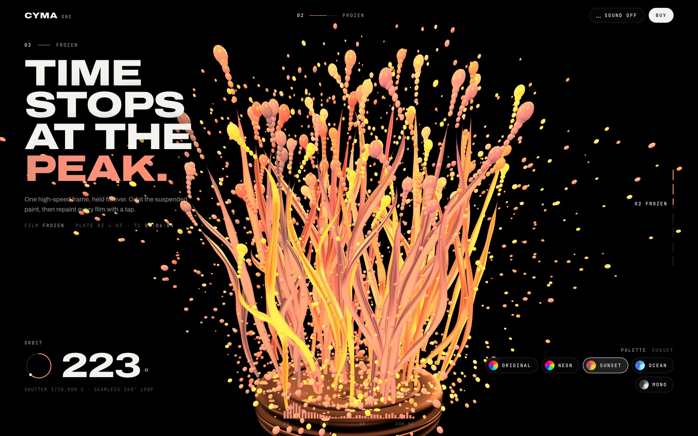
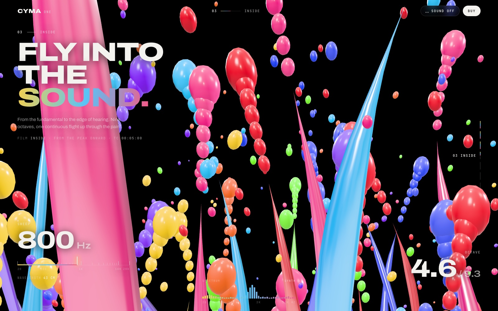
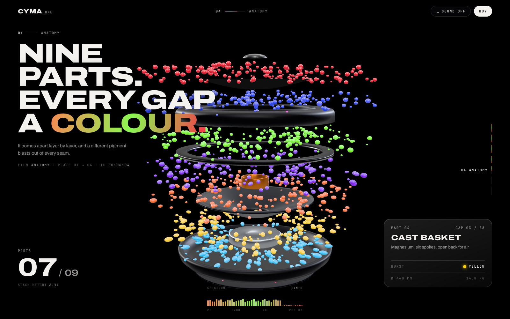
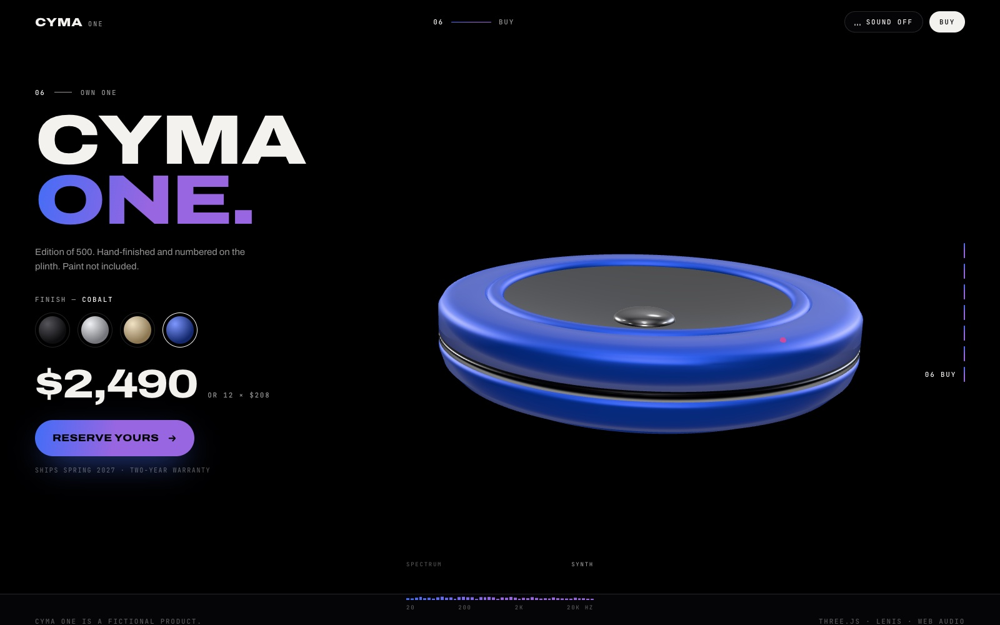

# Site 3D — CYMA One

**[▶ Ver o site no ar](https://dv-tiagocarvalho.github.io/site-3d/)**

Site 3D com scroll para o **CYMA One**, um speaker escultural fictício. Quando o grave cai, a tinta em cima do cone explode numa fonte de arco-íris sobre fundo preto.



Tudo é renderizado em tempo real com WebGL. Cada chapter é um "filme" controlado pelo scroll.

## Chapters

### Plate
O speaker de alumínio jateado, e as 15 gotas de tinta em 8 cores caindo no cone.



### The Drop
Silêncio, depois um 808 a 32 Hz: o cone dá o soco e a tinta sobe em câmera ultra lenta. A frequência pula para 32 Hz e o contador de cores no ar vai de 0 a 8.



### Frozen
O tempo para no pico e a câmera orbita 360°. Os chips de paleta (Original, Neon, Sunset, Ocean, Mono) recolorem tudo com filtros CSS, e a interface acompanha a cor da tinta.

| Original | Sunset |
| --- | --- |
|  |  |

### Inside
A câmera voa para dentro da tinta enquanto a frequência varre de 32 Hz a 20 kHz.



### Anatomy
O speaker se desmonta em 9 peças, com uma cor diferente explodindo de cada vão. Um glass card mostra a peça atual.



### Specs e Buy
Números com count-up e troca de acabamento (Carbon, Titanium, Sand, Cobalt) direto no modelo 3D.



## Extras

- Sampler de cor: lê os pixels mais saturados do frame e aplica a cor da tinta no texto em gradiente
- HUD de espectro na parte de baixo da tela
- Cursor que espirra tinta e faz splat no clique
- 808 em Web Audio no momento do drop (o som começa desligado)
- Links diretos para um chapter, por exemplo [`?go=frozen&p=0.5&palette=Neon`](https://dv-tiagocarvalho.github.io/site-3d/?go=frozen&p=0.5&palette=Neon)

## Rodar localmente

```bash
python3 -m http.server 4317
```

Depois abra http://localhost:4317.

Feito com [Three.js](https://threejs.org) e [Lenis](https://lenis.darkroom.engineering). Os dois são carregados de CDN, então não precisa instalar nada.
